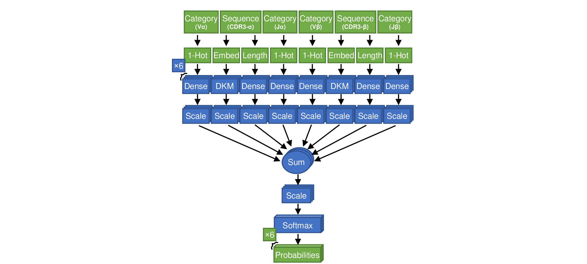

## Antigen Classification Problem

To illustrate *dynamic kernel matching* (DKM) can be used to classify sequences, we modify a multinomial regression model with DKM and fit it to the antigen classification dataset [(link)](https://github.com/jostmey/dkm/tree/master/antigen-classification-problem/dataset). To perform DKM on a sequence, we implement a sequence alignment algorithm in TensorFlow. See `alignment_score.py` for our implementation of the [Needleman-Wunsch algorithm](https://en.wikipedia.org/wiki/Needleman–Wunsch_algorithm) in TensorFlow. A Keras wrapper is provided in `Alignment.py`.



## Running the model

The script below fits a DKM augmented multinomial regression model to the antigen classification dataset. The initialization of the model can take 15 minutes or more before gradient optimization begins.

```
mkdir bin
python3 train_val.py --database ../dataset/database.h5 --table_train Receptor-PMHC-Complex/train --table_val Receptor-PMHC-Complex/validate --tags A0201_GILGFVFTL_Flu-MP_Influenza_binder A0301_KLGGALQAK_IE-1_CMV_binder A0301_RLRAEAQVK_EMNA-3A_EBV_binder A1101_IVTDFSVIK_EBNA-3B_EBV_binder A1101_AVFDRKSDAK_EBNA-3B_EBV_binder B0801_RAKFKQLL_BZLF1_EBV_binder --output bin/model
```

As the script runs, columns of numbers are printed on the screen. The five columns of numbers report:
1. The gradient optimization step,
2. the cross-entropy loss over the training cohort,
3. the classification accuracy over the training cohort,
4. the cross-entropy loss over the validation cohort,
5. and the classification accuracy over the validation cohort.

After fitting the model, we can evaluate its performance on the test cohort.

```
python3 test.py -database ../dataset/database.h5 --table Receptor-PMHC-Complex/test --tags A0201_GILGFVFTL_Flu-MP_Influenza_binder A0301_KLGGALQAK_IE-1_CMV_binder A0301_RLRAEAQVK_EMNA-3A_EBV_binder A1101_IVTDFSVIK_EBNA-3B_EBV_binder A1101_AVFDRKSDAK_EBNA-3B_EBV_binder B0801_RAKFKQLL_BZLF1_EBV_binder --cutoff 0.783349 --input bin/model --output bin/model
```

The script reports the cross-entropy loss and the classification accuracy over the test cohort. We achieved a classification accuracy of 70.5%. Given that we balance over six possible outcomes, the baseline accuracy achievable by chance is 1/6, or equivalent to guessing the outcome of a six-sided die toss.

## Confidence Cutoffs

See the README for the repertoire classification model [(link)](../../repertoire-classification-problem/model/README.md#confidence-cutoffs)
