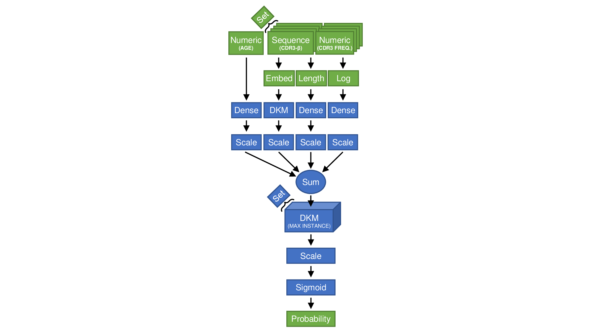

## Repertoire Classification Problem

To illustrate *dynamic kernel matching* (DKM) can be used to classify sets of sequence, we modify a logistic regression model with DKM and fit it to the repertoire classification dataset [(link)](https://github.com/jostmey/dkm/tree/master/repertoire-classification-problem/dataset). To handle sets of sequences, we apply DKM twice, first to handle the sequences and then again to handle the set. We handle sequences using the code from the antigen classification problem, and we handle the sets by taking the maximum scoring sequence.



## Model fitting

Two special aspects for fitting the model are (i) gradient aggregation and (ii) many local minima.

###### Gradient Aggregation
Each sequenced immune repertoire contains an average of over 100,000 receptors with almost 10,000,000 features per sample. Consequently, only one or a few immune repertoires can be fit into GPU memory at any given time. To fit the model to the training data, we rely on gradient aggregation, which is where the gradients with respect to the cross-entropy loss function are computed one sample at a time in a serial fashion. Afterwards, the gradients are added together and the weights are updated. Gradient aggregation achieves the same computation as if the gradients are computed with respect to the cross-entropy loss over all the samples simultaneously, as is commonly done.


###### Many Local Minima
After running 128 steps of gradient optimization, we observe the fit strongly depends on initial weights. If we refit the model using different values for the initial values for the weights then we get a substantially different result. This indicates the cross-entropy landscape contains many local minima. To attempt to find a global best fit to the training data, we refit the model 128 times, each time starting from different initial values for the weights. We use the weights from the best fit, as measure over the training cohort (the validation cohort have not been used yet).


## Running the model(s)

Running the script `train_val.py` fits 16 copies of the model to the training cohort. We run the script 8 times, resulting in a total of 128 copies of the model. We find the best fit to the training cohort out of all 128 copies. The initialization of the model can take 15 minutes or more before the gradient optimization begins. The script assumes the GPU has the same memory as a P100 16GB GPU.

```
mkdir bin
python3 train_val.py --gpu 0 --database ../dataset/database.h5 --cohort_train Cohort_I --split_train samples_train --cohort_val Cohort_I --split_val samples_validate --output bin/model_1 > bin/train_val_1.out
python3 train_val.py --gpu 1 --database ../dataset/database.h5 --cohort_train Cohort_I --split_train samples_train --cohort_val Cohort_I --split_val samples_validate --output bin/model_2 > bin/train_val_2.out
python3 train_val.py --gpu 2 --database ../dataset/database.h5 --cohort_train Cohort_I --split_train samples_train --cohort_val Cohort_I --split_val samples_validate --output bin/model_3 > bin/train_val_3.out
python3 train_val.py --gpu 3 --database ../dataset/database.h5 --cohort_train Cohort_I --split_train samples_train --cohort_val Cohort_I --split_val samples_validate --output bin/model_4 > bin/train_val_4.out
python3 train_val.py --gpu 4 --database ../dataset/database.h5 --cohort_train Cohort_I --split_train samples_train --cohort_val Cohort_I --split_val samples_validate --output bin/model_5 > bin/train_val_5.out
python3 train_val.py --gpu 5 --database ../dataset/database.h5 --cohort_train Cohort_I --split_train samples_train --cohort_val Cohort_I --split_val samples_validate --output bin/model_6 > bin/train_val_6.out
python3 train_val.py --gpu 6 --database ../dataset/database.h5 --cohort_train Cohort_I --split_train samples_train --cohort_val Cohort_I --split_val samples_validate --output bin/model_7 > bin/train_val_7.out
python3 train_val.py --gpu 7 --database ../dataset/database.h5 --cohort_train Cohort_I --split_train samples_train --cohort_val Cohort_I --split_val samples_validate --output bin/model_8 > bin/train_val_8.out
```

Results to be added

## Confidence Cutoffs

Results to be added
